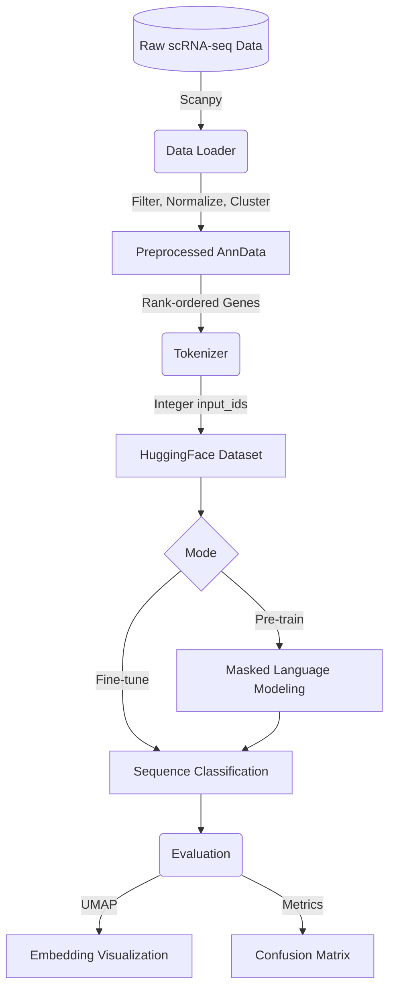

# 🧬 Single-Cell Foundation Model


A professional end-to-end Machine Learning pipeline for training and evaluating Transformer-based Foundation Models on single-cell RNA sequencing (scRNA-seq) data.

## 🌟 Overview

Foundation models in biology (like Geneformer or scGPT) are revolutionizing our understanding of cellular dynamics. Instead of treating cells as numerical matrices, they treat cells as "sentences" and genes as "words," allowing large language models (LLMs) to learn deep biological representations.

This repository provides a complete pipeline to:
1. **Ingest and preprocess** raw scRNA-seq datasets.
2. **Tokenize** gene expression data into rank-ordered sequences.
3. **Pre-train** a Transformer using Masked Language Modeling (MLM).
4. **Fine-tune** the model for downstream tasks like cell-type classification.
5. **Evaluate** learned representations using UMAP embeddings and confusion matrices.

## 🏗️ Architecture



## 🚀 Getting Started

### 1. Installation

Create a virtual environment and install the required dependencies:

```bash
python -m venv venv
source venv/bin/activate  # On Windows: venv\Scripts\activate
pip install -r requirements.txt
```

### 2. Configuration

All model hyperparameters and training arguments are managed in `config.yaml`. You can easily adjust the `learning_rate`, `batch_size`, or `hidden_size` without touching the code.

### 3. Running the Pipeline

Execute the full pipeline, which handles data downloading, tokenization, training, and evaluation:

```bash
cd src
python main.py
```

## 🧪 Testing

This project uses `pytest` to ensure data integrity and tokenization correctness. To run the test suite:

```bash
pytest tests/
```

## 📊 Results

After running `main.py`, evaluation plots and trained model weights will be saved in the `results/` directory:
- `results/umap_embeddings.png`: Visualizes how well the model separates different cell types.
- `results/confusion_matrix.png`: Details classification accuracy across pseudo-labels.
